# Лабораторная работа №1

## Описание задач

1. Настроить работу веб-сервера Nginx по протоколу HTTPS с использованием сертификата.
2. Настроить перенаправление HTTP-запросов (порт 80) на HTTPS (порт 443) для обеспечения безопасного соединения.
3. Использовать `alias` для создания псевдонимов путей к файлам или каталогам на сервере.
4. Настроить виртуальные хосты для обслуживания нескольких доменных имен на одном сервере.

## Часть 1: Настройка Nginx и HTTPS

### Шаг 1: Проверка работы Nginx

Первым делом проверяем, установлен ли веб-сервер Nginx и работает ли он корректно. Для этого вводим в адресную строку браузера свой IP-адрес и проверяем ответ сервера.

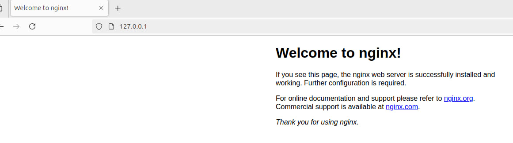

### Шаг 2: Создание директорий для проектов

Создаем две директории, которые будут содержать наши проекты. Для каждого проекта создаем простой HTML-файл.

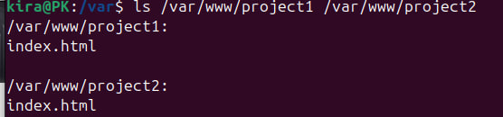

### Шаг 3: Генерация SSL-ключа

Для обеспечения безопасного соединения создаем SSL-ключ для работы сервера на порту 443.

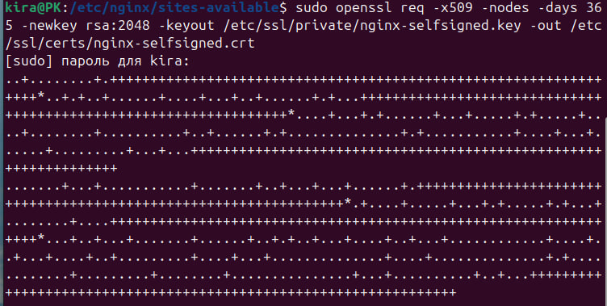

### Шаг 4: Настройка перенаправления HTTP на HTTPS

Конфигурируем сервер так, чтобы запросы на порт 80 (HTTP) автоматически перенаправлялись на порт 443 (HTTPS). Указываем путь к SSL-ключам в конфигурационном файле Nginx.

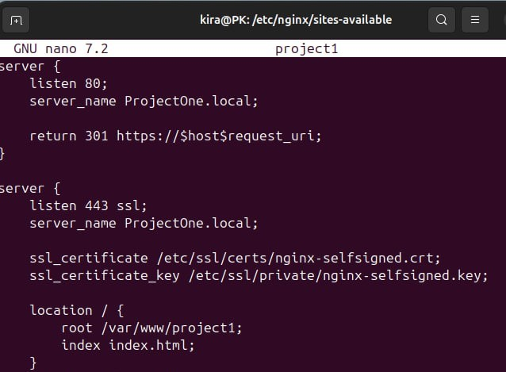
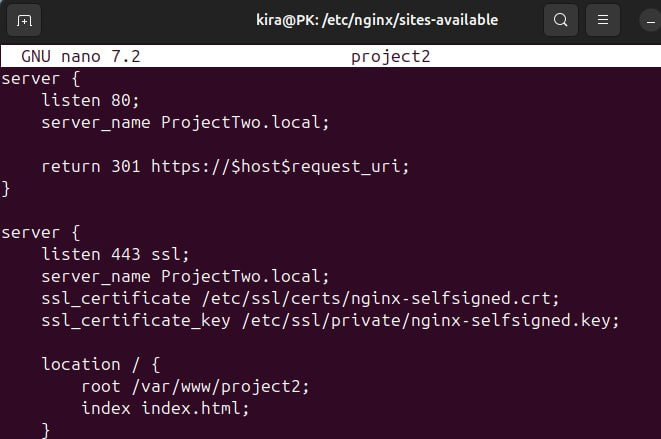

### Шаг 5: Настройка файла `hosts`

Для корректной работы создаем записи для каждого проекта в файле `hosts`, добавляя их доменные имена.

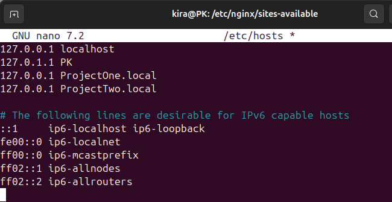

### Шаг 6: Перезапуск Nginx и проверка

Перезапускаем Nginx и проверяем работоспособность сайтов, вводя их доменные имена в браузере.

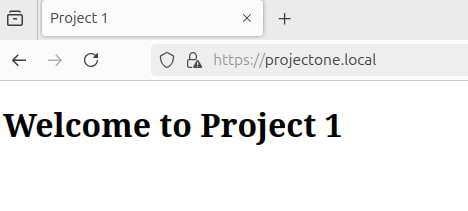
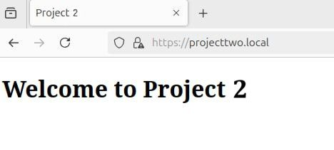

## Часть 2: Использование alias

### Шаг 1: Создание директорий для изображений

Создаем директорию для хранения изображений, которые будут использоваться в наших проектах.

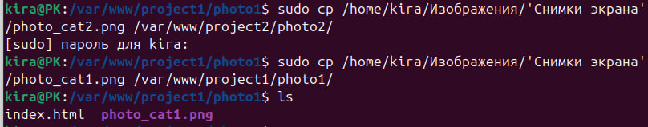

### Шаг 2: Добавление изображений в HTML

В HTML-файлах проектов прописываем код для вывода изображений.

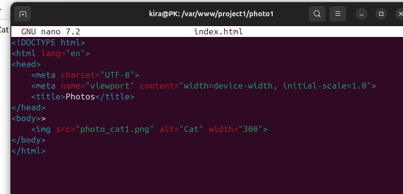
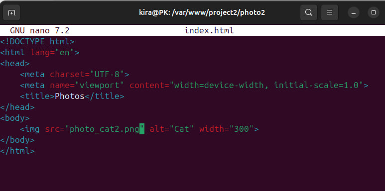

### Шаг 3: Настройка путей к изображениям

В конфигурации Nginx добавляем путь до директории с изображениями, используя директиву `alias`.

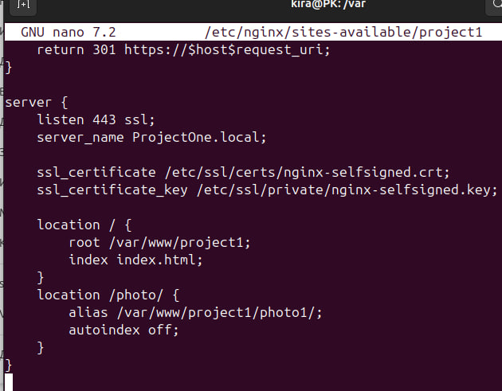
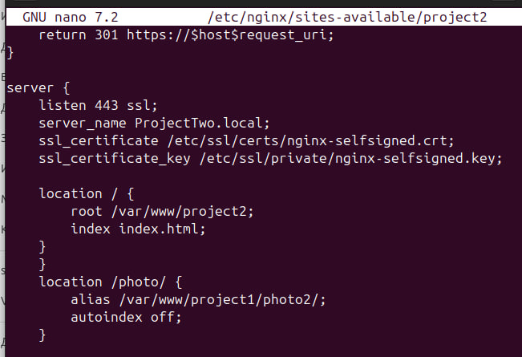

### Шаг 4: Перезагрузка Nginx и проверка

Перезагружаем Nginx и проверяем корректность отображения изображений на страницах.

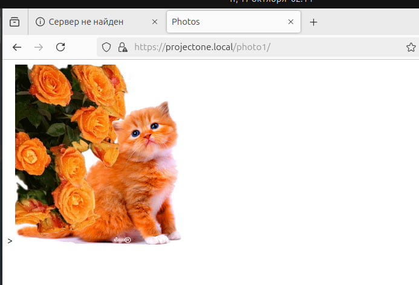
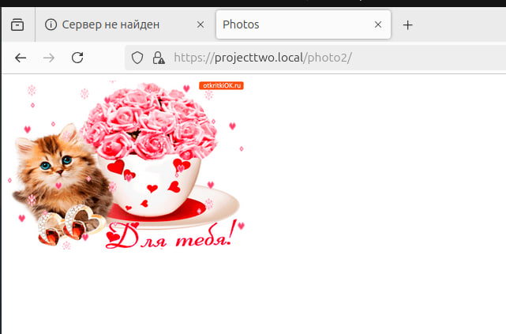

## Заключение

В ходе лабораторной работы мы настроили веб-сервер Nginx для работы по HTTPS, добавили перенаправление с HTTP на HTTPS, использовали `alias` для отображения изображений и настроили виртуальные хосты для нескольких проектов.

---

## Задание со *

### Описание задач

Цель задания — проверить Nginx другого участника на наличие уязвимостей. Мы проверяли следующие уязвимости:

- Path Traversal
- Перебор страниц через DirBuster
- Cross Site Scripting (XSS)

### Подготовка

Для выполнения атаки необходимо было:

1. Клонировать репозиторий с сервисом: `https://github.com/Sandrolek/ITMO-devops-labs/tree/main/lab1`
2. Запустить сервисы.

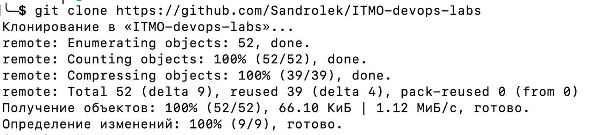
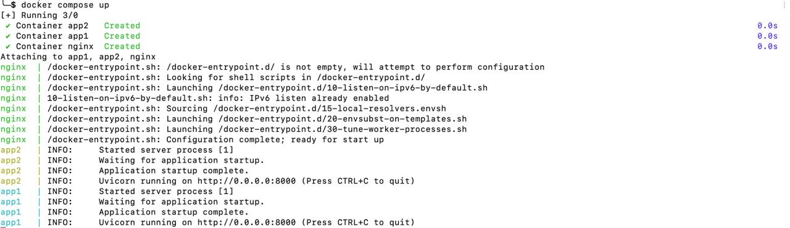

### Path Traversal

- Скриншот попытки взлома:

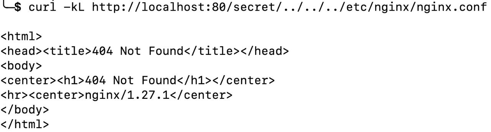

    Path Traversal (или Directory Traversal) — уязвимость, позволяющая злоумышленнику получить доступ к файлам и директориям, которые не должны быть доступны. Достигается путем манипуляции с путями файлов в запросах.
  
- Результат: Получить конфигурационные файлы не удалось. Сервер возвращает ошибку 404.

### Перебор страниц через DirBuster

- Скриншот попытки взлома:

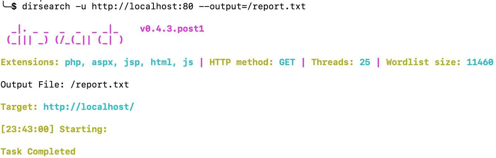

    Перебор страниц через DirBuster — это метод поиска скрытых страниц и директорий на сервере. DirBuster автоматически перебирает возможные URL на основе словарей.

- Результат: Уязвимость не была найдена.

### Cross Site Scripting (XSS)

- Код для проведения атаки:

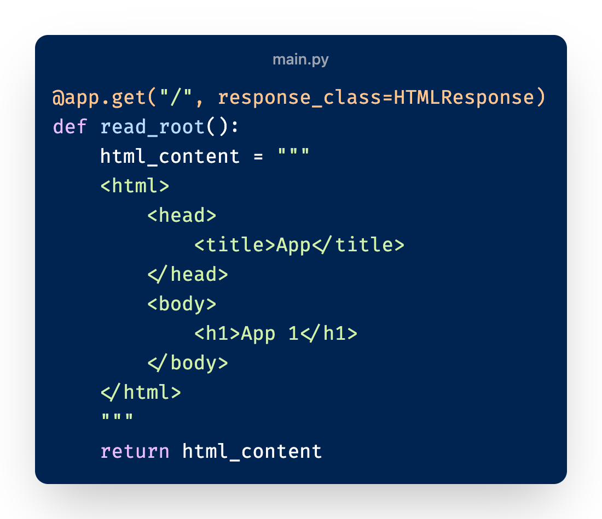
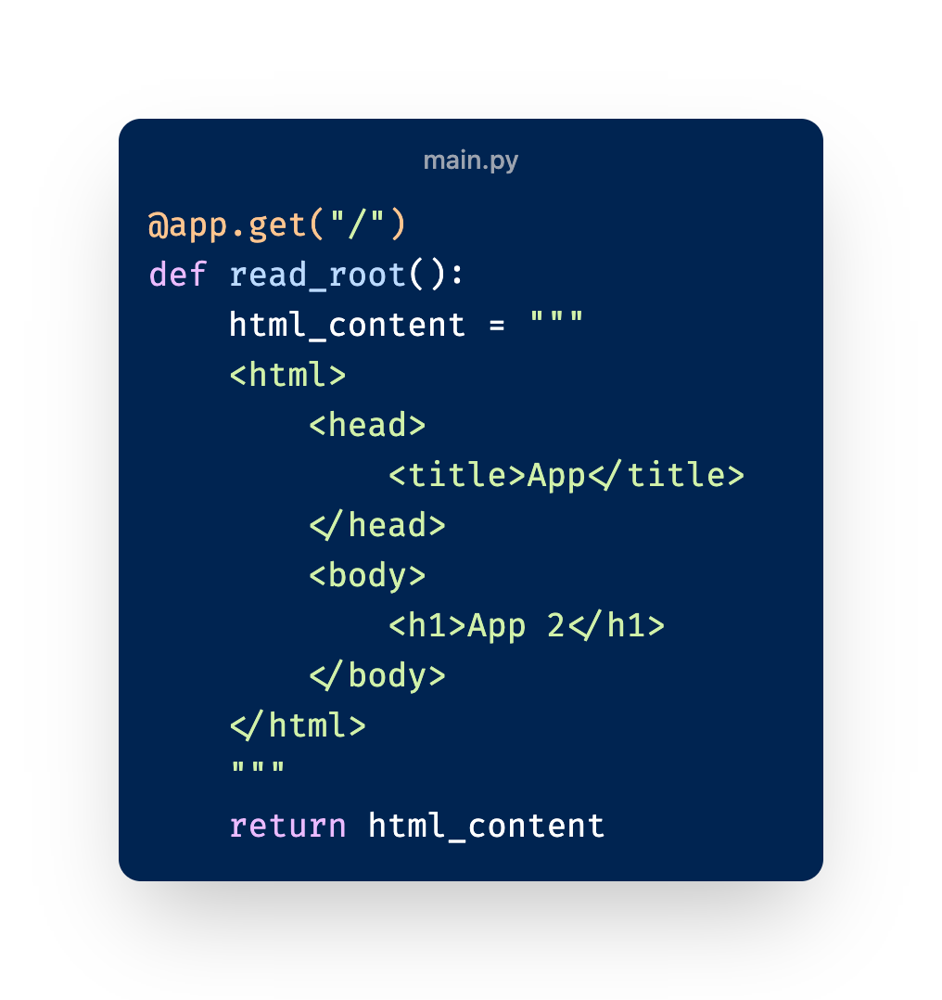

    XSS — уязвимость, позволяющая внедрять вредоносные скрипты на веб-страницы, которые видят другие пользователи. Эти скрипты могут выполнять различные вредоносные действия, такие как кража данных или подделка запросов.

- Результат: Внедрение XSS возможно при использовании неэкранированных данных и небезопасных библиотек.

## Заключение

Удалось провести проверку на три уязвимости: Path Traversal, перебор страниц через DirBuster и XSS. 
